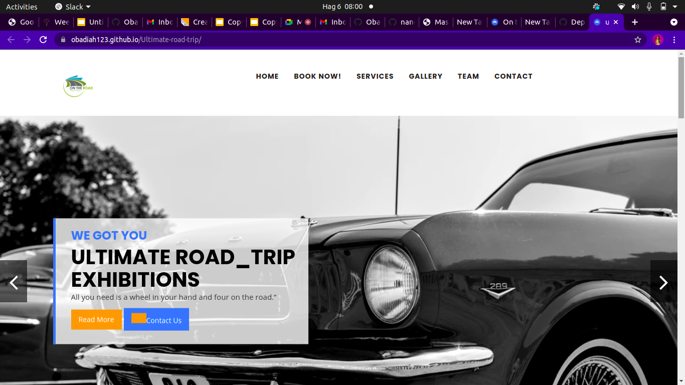
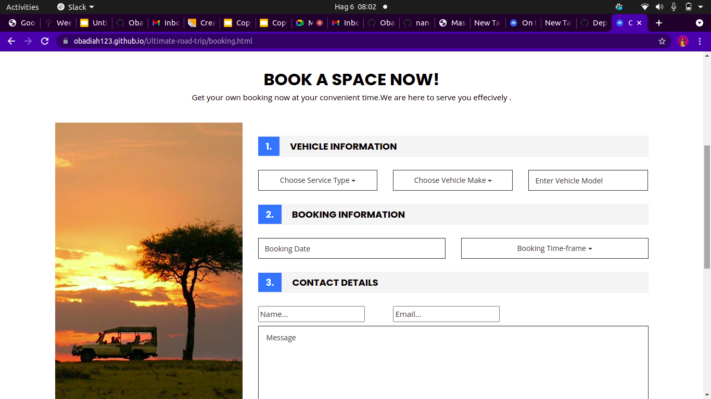
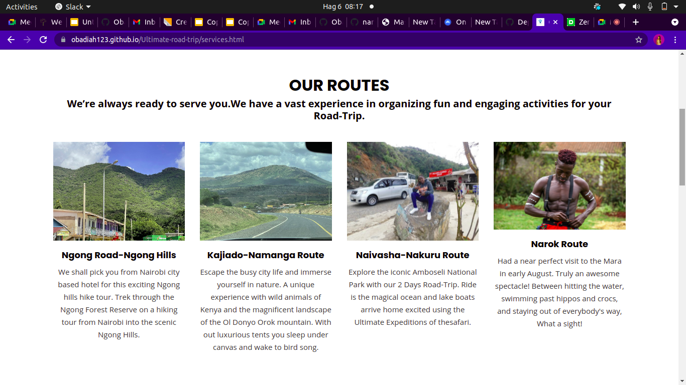
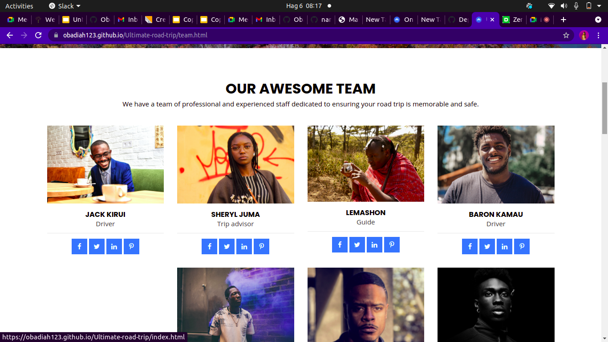
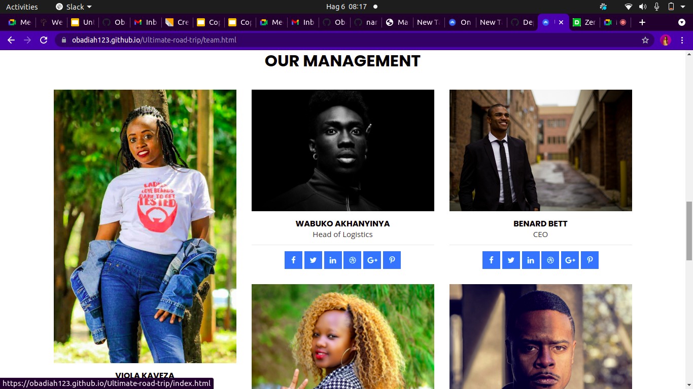
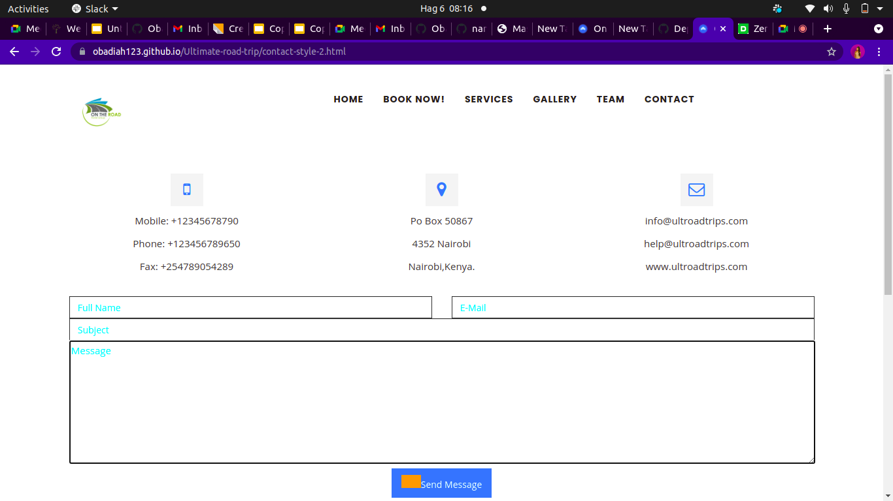
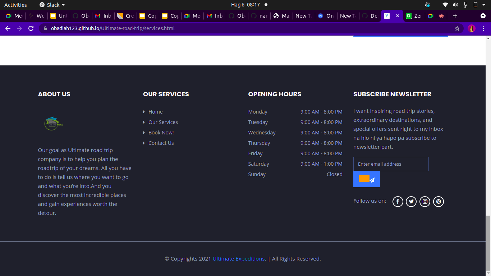

# ULTIMATE ROAD TRIP EXPEDITION.
# THIS PROJECT WAS DEVELOPED BY;
* NANCY KIGOTHO.
* AGGREY WABUKO.
* SHEM KIIRU.
* VIOLA KAVEZA.
* BENARD BETT.
# DESCRIPTION.
* This is a website that helps you plans a trip. it allows you to choose the route,the type of vehicle and a driver of your choice.
# INSTRUCTIONS.
* To book a slot fill in the form on the bookings pages and make sure to give accurate information.
* To leave us a message fill in the form on the ontact us page.
# TECHNOLOGIES USED.
* HTML.
* CSS.
* Javascript.
* Bootstrap.
* Jquery.
# CONTACT INFORMATION.
* if you have any questions about the project please contact us via ultroadtrip@gmail.com
# REQUIREMENTS.
* Github.
* Git.
* web browser.
# LIVE LINK
https://github.com/ObadiaH123/Ultimate-road-trip/deployments/activity_log?environment=github-pages
# IMAGES.

# LICENCESING
MIT LICENCE.

